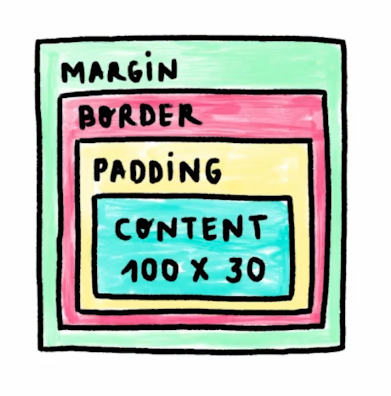

# Notas de HTML y CSS
## ¿Qué es HTML y CSS?
### HyperText Markup Language (HTML)
El lenguaje de etiquetas de hipertexto es el código con el que se estructura una página web. (el esqueleto)
### Cascading style sheets
Las hojas de estilo en cascada es el lenguaje que le da colores, forma, tamaño, formato a los elementos de nuestro esqueleto (el código html). 
### Motores de renderizado
Cada navegador tiene su propio motor de renderizado para poder "traducir" nuestros archivos de código html y css a algo que puede entender el navegador y lo transforma en pixels (algo visual) para que nosotros lo podamos visualizar. 
| Navegador | Motor |
| --- | --- |
| Chrome | Blink |
| Edge | Edge html |
| Safari | Webkit |
| Firefox | Gecko
#### Pasos de los motores de los navegadores para tranformar el código
1. Pasar los archivos a objetos (DOM)
    El Document Object Model (DOM) es la representación de nuestro código HTML en una estructura de árbol. El motor de 
    

    Y el equivalente de este árbol en código lo puedes ver [aquí](DOM-ejemplo.html)
    
    ***El DOM representa la relación entre las etiquetas de los archivos HTML.***
    El CSSDOM (Cascade Style Sheet Object Model) es lo mismo que el DOM pero con los archivos CSS.
2. **Calcula el estilo** correspondiente a cada nodo del DOM
    Toma cada uno de los estilos css que tenga cada uno de los nodos del árbol y los añade.
3. **Cálcula las dimensiones** de cada nodo y dónde va en la pantalla. 
4. Pinta o renderiza los diferentes elementos como **cajas o contenedores** (las etiquetas que se muestran en el ejemplo)
5. Agrupa todas las cajas en diferentes capas para **convertirlas en una imagen que se renderiza en pantalla**
## Anatomía de un documento HTML y sus elementos
Cada elemento del código HTML se conforma del siguiente contenido:

- Etiquetas
    - Este es la representación de un elemento html. Tiene una etiqueta de apertura y una de cierre.
    - Ejemplo:
        ```html
        <h1></h1>
        ```
- Contenido
    -   Es el texto o elemento que se encierra entre la etiqueta. Puede que tenga texto o no (Depende de la etiqueta)
    - Ejemplo
        ```
        <h1>Este es el contenido</h1>
        ```
- Atributos
    - Estos manejan el comprtamiento de un elemento, se escriben dentro de la etiqueta de inicio.
- Elementos vacios
    - Hay etiquetas que no tienen contenido y etiqueta de apertura, por lo general se les agrega atributos y este determina el comportamiento de dicha etiqueta
    - Ejemplo
        ````
        
        ```
- Anidamiento
    Estas son etiquetas dentro de otras etiquetas, esto es regular en HTML. Esto dependera de la estructura que necesitemos.
    - Ejemplo
        ```
            <section>
                <h1>Hola Mundo</h1>
            </section>
            <!-- Una lista no organizada -->
            <ul>
                <!-- Elementos de la lista no ordenada -->
                <li>Increíble</li>
                <li>Maravilloso</li>
                <li>Genial</li>
        ```
## Elementos de la estructura principal
Para  ver la estrucutra de un archivo html da click [aquí](estructura.html)
### Etiqueta Doctype
Esta etiqueta especifica que el archivo se va a manejar con la versión 5 de HTML.
### Etiqueta html
Esta etiqueta define el elemento raíz de un archivo HTML. Es la etiqueta madre y todos los demás elementos deben de estar dentro de esta etiqueta. Aquí se especifica el lenguaje de la página web con la propiedad **lang**
### Etiqueta head
Esta etiqueta define la **metainformación**, lo que quiere decir que estará toda la información que no es contenido de una página web. Aquí van los archivos CSS, JavaScript, el título y la imagen (favicoon) que aparece en la pestaña de navegación. Aquí también va más información que es importante para los ***motores de busqueda*** como Google.
## HTML SEMÁNTICO
En html tenemos la etiqueta ```<div>```, esta etiqueta nos sirve como contenedor pero carece de valor semántico lo que significa que no significan nada para los motores de busqueda como google.
### Etiquetas Semánticas
En el siguiente [archivo](EtiquetasSemanticas.html) tenemos un ejemplo de etiquetas.
Aquí tenemos el ejemplo con una imagen de cómo estas etiquetas podrían estar estructuradas en nuestra página web. También estas son las etiquetas más utilizadas de html para la parte del layout. 

***Es importante aclarar que todo esto podemos hacerlo con div pero no tendríamos las ventajas que se mencionan a continuación***
### Ventajas de utilizar HTML semántico
- Ayuda a tu sitio a ser accesible, esto es porque el sitio va a leer la etiqueta que es y ayuda con los programas de accesibilidad.
- Mejora tu posicionamiento (SEO)
- Código más claro, legible y mantenible, haras que otros desarrolladores o tu yo del futuro pueda entender a qué se refiere esa parte del contenido, ya que no tendrás puras etiquetas ```<div></div>``` anidadas.
- Ayuda a buscadores (como Google a encontrar tu página)

Esta es una [documentación de HTML](https://htmlreference.io/)
### Etiquetas con diferencias semánticas
La etiqueta ```<b>``` pone el texto en negritas pero no tiene sentido semántico.
La etiqueta ```<strong>``` pone el texto en negritas pero SI tiene sentido semántico.
La etiqueta ```<i>``` pone el texto en cursivas pero no tiene sentido semántico.
La etiqueta ```<em>``` pone el texto en cursivas pero SI tiene sentido semántico.

## Maquetación con CSS

### Declaración CSS
La declaración CSS es un bloque de código que especifica los estilos que tendrá un elemento HTML en específico. Su estructura es la siguiente:

- Selector: define el elemento o conjunto de elementos a los cuales se añadirán los estilos.
- Propiedad: es el nombre del estilo de CSS.
- Valor: es el valor que tomará la propiedad.

### Tipos de selectores
- De tipo: div {...}
    - La etiqueta que vamos a estilizar en general, puede servir para cuando hacemos páginas pequeñas.
- De clase: .elemento {...}
    - Este estilo solamente lo tomaran los elementos que les asignemos tal nombre, esto se hace poniendo un atributo llamado "class" en la etiqueta. 
- De ID: #id-del-elemento {...}
    - Este estilo lo tomará el elemento que nombremos con tal ID, la diferencia con los selectores de clase es que solamente puedes tener un único elemento con dicho nombre. No es repetible el ID para más de un elemento. 
- De atributo: a[href=" "] {...}
    - Se puede estilizar los atributos
- Universal: * {...}
    - Todos los elementos se estilizan con lo que se agregue aquí

### Selectores combinadores
- Descendientes: div p
- Hijo directo: div > p
- Elemento adyacente: div + p
- General de hermanos: div ~ p
En el siguiente [enlace](selectores-combinadores.html) podemos ver en código la explicación de estos selectores

### Pseudoclases y Psudoelementos

|Pseudoclases|Pseudoelementos|
|---|---|
|:active|::after|
|:focus|::before|
|:hover|::first-letter|
|:nth-child(n)|::placeholder|

Los psudoelementos por ejemplo nos permiten llegar a los elementos que no son accesibles con html como el estilizar una letra de un elemento. 

### Cascada y especificidad en CSS
El orden importa en CSS. Esto porque puede llegar a sobreescribir con los estilos que pongamos abajo.
Los navegadores determinan qué reglas de Css deben aplicarse a las etiquetas HTML. El orden y el origen de clasificación del CSS, intervienen en este proceso. 
Sin embragom, no todo es color de rosa. A veces los navegadores entran en conflicto porque no saben qué regla aplicar. 
Es gracias a la especificidad de los selectores resuelven este problema. 
Entre mayor especificidad, mayor va a ser la probabilidad de que sus declaraciones se usen sobre las demás.
¿Cómo podemos saber qué reglas de CSS tienen mayor especificidad?


[Aquí](https://specificity.keegan.st/) hay una calculadora de especificidad

## Tipo de display
Es el tipo de visualización que tienen los elementos

- block
- inline
    - No le podemos cambiar su anchura, no es posible agregarle todas las propiedades del modelo de caja excepto el margen horizontal.
- inline-block
    - Combina las ventajas de ambos como ponerle las propiedades del modelo de caja y el colocar un elemento seguido del otro en el mismo espacio.
- flex
    - recursos: 
        - [juego para aprender](https://flexboxfroggy.com/#es)
        - [documentación](https://css-tricks.com/snippets/css/a-guide-to-flexbox/) 
- grid
    - recursos:
        - [juego para aprender](https://cssgridgarden.com/)
        - [documentación](https://css-tricks.com/snippets/css/complete-guide-grid/)
        

Todos los elementos ya tienen por defecto un tipo de visualización, ya sea en bloque o en linea.
## Modelo de caja
Todos los elementos están compuestos por un modelo de caja, este modelo de caja se compone de cuatro elementos:
- ***margin***
    - este es el espaciado entre el borde y otro elemento, podemos verlo como el espaciado exterior de un elemento con otro.
- ***border***
    - Es esa linea que representa nuestro elemento, si lo vemos en terminos de figuras esta sería la línea que se dibuja (el contorno). Lo podemos estilizar o simplemente ocultar dicha línea si no queremos que se vea.
- ***padding***
    - Es el espaciado entre el borde y el elemento, este es un espaciado interior por lo cual no afectaría a la separación con otro elemento, afectará el espacio interior de este elemento.
- ***contenido***
    - Lo que ponemos dentro de nuestro elemento como puede ser texto, una imagen, figuras, etc.

### Ejemplo del modelo de caja


### Valores por defecto
El navegador asigna algunos valores CSS a algunos elementos, por lo cual es buena práctica que a nuestros proyectos los empecemos con el siguiente formateo:
```
* {
    margin: 0;
    padding: 0;
}
```
### Tamaño total del elemento
Como lo vimos en la imagen, cada parte del modelo de la caja puede tener un tamaño, si le agregamos el contenido este tendrá un tamaño pero si lo estilizamos le podemos definir un total de ancho y alto. Si agregamos un borde y un padding entonces esta medida aumentará. El tamaño total de este elemento ya no solo dependerá de la medida de ancho y alto que le pongamos con CSS, también se le tendrá que sumar el padding y border.
Si necesitamos que nuestro elemento tenga si o si la medida que le hemos puesto de alto y ancho entonces podemos poner la siguiente propiedad de CSS:
```
* {
  box-sizing: border-box;
}
```
Esta propiedad ***box-sizing*** establece cómo se calculará el ancho y el alto si incluye bordes y espacios internos. 
Es importante destacar que a nuestros elementos debemos de ***Evita agregar un tamaño diferente al inicial.***
Por ejemplo, si queremos que adopten cierto comportamiento cuando pasemos el mouse sobre un elemento y este tenga ahora un borde, entonces estaríamos modificando nuestro contenido y medidas del modelo de caja. Esto provocaría que tengmos una animación un tanto rara, por lo que la solución sería que prevengamos antes esto y le pongamos un borde transparente antes para que no tenga un efecto raro.

### Colapso de margenes
Si nuestros elementos estan dentro de un display block entonces nuestros margenes verticales se van a colapsar, esto lo podemos solucionar cambiando el tipo de display. 